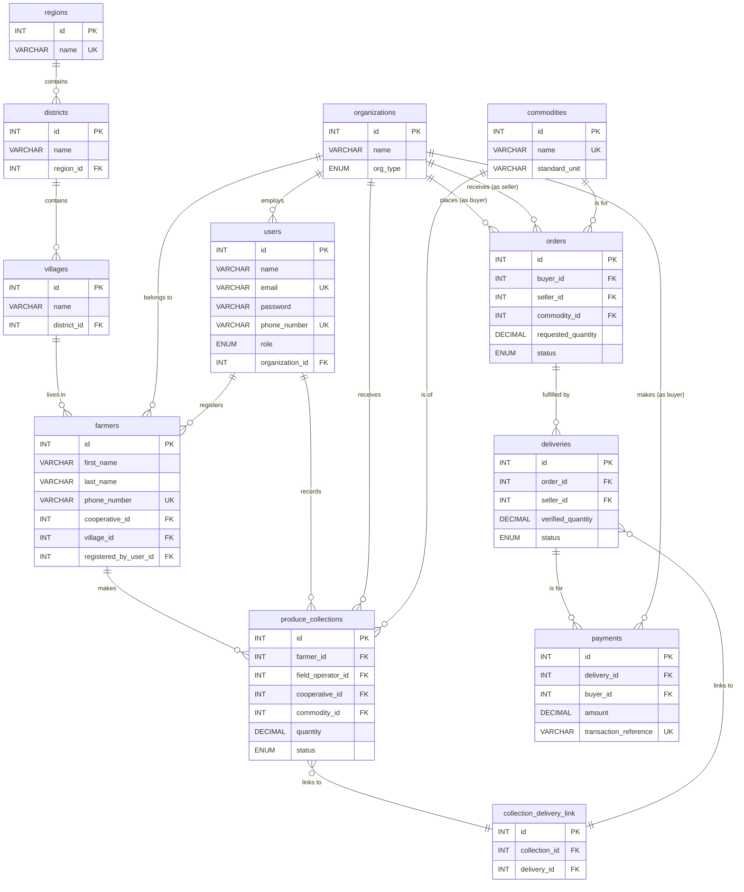

# 🌱 FarmGrid API — Database Schema Documentation

## 🗂️ Overview

This document describes the **FarmGrid API** database schema, designed for a scalable, normalized multi-commodity agricultural supply chain. Built on **MySQL** and managed via **Knex.js migrations**.

**Schema Philosophy:**

1. **Users & Organizations** — Access control and entity management
2. **Geographical Data** — Hierarchical location structure
3. **Core Agricultural Data** — Farmers and produce types
4. **Transactional Data** — Workflow from collection to payment

---

## 📊 Entity-Relationship Diagram (ERD)

Click to expand ERD (Mermaid)

---

# 📋 Table Definitions

## 1️⃣ Users & Organizations

### 🏢 organizations
_Stores records of all business entities, such as cooperatives and buyers._

| Column            | Type                                         | Constraints                  | Description                       |
|-------------------|----------------------------------------------|------------------------------|-----------------------------------|
| `id`              | INTEGER                                      | PK, AUTO_INCREMENT           | Unique identifier                 |
| `name`            | VARCHAR(255)                                 | NOT NULL                     | Organization name                 |
| `org_type`        | ENUM('COOPERATIVE', 'PROCESSOR', 'BUYER', ...) | NOT NULL                  | Organization role                 |
| `location_details`| TEXT                                         | NULLABLE                     | Address or info                   |
| `created_at`      | TIMESTAMP                                    | DEFAULT CURRENT_TIMESTAMP    | Created at                        |
| `updated_at`      | TIMESTAMP                                    | DEFAULT CURRENT_TIMESTAMP    | Last update                       |

---

### 👤 users
_Stores user accounts for all individuals who can log in._

| Column            | Type            | Constraints                  | Description                  |
|-------------------|-----------------|------------------------------|------------------------------|
| `id`              | INTEGER         | PK, AUTO_INCREMENT           | Unique identifier            |
| `name`            | VARCHAR(255)    | NOT NULL                     | Full name                    |
| `email`           | VARCHAR(255)    | NOT NULL, UNIQUE             | Login email                  |
| `password`        | VARCHAR(255)    | NOT NULL                     | Hashed password              |
| `phone_number`    | VARCHAR(20)     | UNIQUE                       | User’s phone number          |
| `role`            | ENUM('SYSTEM_ADMIN','COOP_ADMIN',...) | NOT NULL | Access level                  |
| `organization_id` | INTEGER         | FK → organizations.id        | Linked organization          |
| `is_active`       | BOOLEAN         | DEFAULT TRUE                 | Active/disabled account      |
| `created_at`      | TIMESTAMP       | NOT NULL                     | Created at                   |
| `updated_at`      | TIMESTAMP       | NOT NULL                     | Last update                  |

---

## 2️⃣ Geographical Data

### 🌍 regions
| Column   | Type         | Constraints                  | Description    |
|----------|--------------|------------------------------|----------------|
| `id`     | INTEGER      | PK, AUTO_INCREMENT           | Unique ID      |
| `name`   | VARCHAR(100) | NOT NULL, UNIQUE             | Region name    |

---

### 🏞️ districts
| Column     | Type         | Constraints                  | Description    |
|------------|--------------|------------------------------|----------------|
| `id`       | INTEGER      | PK, AUTO_INCREMENT           | Unique ID      |
| `name`     | VARCHAR(100) | NOT NULL                     | District name  |
| `region_id`| INTEGER      | NOT NULL, FK → regions.id    | Parent region  |

---

### 🏡 villages
| Column       | Type         | Constraints                   | Description    |
|--------------|--------------|-------------------------------|----------------|
| `id`         | INTEGER      | PK, AUTO_INCREMENT            | Unique ID      |
| `name`       | VARCHAR(100) | NOT NULL                      | Village name   |
| `district_id`| INTEGER      | NOT NULL, FK → districts.id   | Parent district|

---

## 3️⃣ Core Agricultural Data

### 🌾 commodities
| Column         | Type         | Constraints                    | Description         |
|---------------|--------------|--------------------------------|---------------------|
| `id`          | INTEGER      | PK, AUTO_INCREMENT             | Unique ID           |
| `name`        | VARCHAR(100) | NOT NULL, UNIQUE               | Commodity name      |
| `standard_unit`| VARCHAR(20) | NOT NULL, DEFAULT 'kg'         | Measurement unit    |

---

### 👨‍🌾 farmers
| Column                | Type         | Constraints                      | Description         |
|-----------------------|--------------|----------------------------------|---------------------|
| `id`                  | INTEGER      | PK, AUTO_INCREMENT               | Farmer ID           |
| `first_name`          | VARCHAR(100) | NOT NULL                         | First name          |
| `last_name`           | VARCHAR(100) | NOT NULL                         | Last name           |
| `phone_number`        | VARCHAR(20)  | NOT NULL, UNIQUE                 | Farmer phone number |
| `cooperative_id`      | INTEGER      | NOT NULL, FK → organizations.id  | Cooperative         |
| `village_id`          | INTEGER      | NOT NULL, FK → villages.id       | Location            |
| `registered_by_user_id`| INTEGER     | NOT NULL, FK → users.id          | Field operator      |

---

## 4️⃣ Transactional Data

### 🧺 produce_collections
| Column             | Type           | Constraints                      | Description             |
|--------------------|----------------|----------------------------------|-------------------------|
| `id`               | INTEGER        | PK, AUTO_INCREMENT               | Collection ID           |
| `farmer_id`        | INTEGER        | NOT NULL, FK → farmers.id        | Farmer                  |
| `field_operator_id`| INTEGER        | NOT NULL, FK → users.id          | Recorder                |
| `cooperative_id`   | INTEGER        | NOT NULL, FK → organizations.id  | Receiving cooperative   |
| `commodity_id`     | INTEGER        | NOT NULL, FK → commodities.id    | Commodity type          |
| `quantity`         | DECIMAL(10,2)  | NOT NULL                         | Quantity collected      |
| `collection_date`  | TIMESTAMP      | DEFAULT CURRENT_TIMESTAMP        | Date recorded           |
| `status`           | ENUM('IN_STOCK',...) | DEFAULT 'IN_STOCK'         | Status                  |

---

### 📦 orders
| Column              | Type           | Constraints                      | Description             |
|---------------------|----------------|----------------------------------|-------------------------|
| `id`                | INTEGER        | PK, AUTO_INCREMENT               | Order ID                |
| `buyer_id`          | INTEGER        | NOT NULL, FK → organizations.id  | Buyer organization      |
| `seller_id`         | INTEGER        | NOT NULL, FK → organizations.id  | Seller cooperative      |
| `commodity_id`      | INTEGER        | NOT NULL, FK → commodities.id    | Commodity               |
| `requested_quantity`| DECIMAL(10,2)  | NOT NULL                         | Quantity requested      |
| `status`            | ENUM('PENDING',...) | DEFAULT 'PENDING'           | Status                  |
| `order_date`        | TIMESTAMP      | DEFAULT CURRENT_TIMESTAMP        | Order timestamp         |

---

### 🚚 deliveries
| Column             | Type           | Constraints                      | Description             |
|--------------------|----------------|----------------------------------|-------------------------|
| `id`               | INTEGER        | PK, AUTO_INCREMENT               | Delivery ID             |
| `order_id`         | INTEGER        | NOT NULL, FK → orders.id         | Related order           |
| `seller_id`        | INTEGER        | NOT NULL, FK → organizations.id  | Delivering cooperative  |
| `verified_quantity`| DECIMAL(10,2)  | NULLABLE                         | Confirmed amount        |
| `status`           | ENUM('PENDING','IN_TRANSIT',...) | DEFAULT 'PENDING' | Delivery status         |
| `delivery_date`    | DATE           | NULLABLE                         | Delivery date           |

---

### 🔗 collection_delivery_link
| Column         | Type           | Constraints                              | Description             |
|----------------|----------------|------------------------------------------|-------------------------|
| `id`           | INTEGER        | PK, AUTO_INCREMENT                       | Link ID                 |
| `collection_id`| INTEGER        | NOT NULL, FK → produce_collections.id    | Collection reference    |
| `delivery_id`  | INTEGER        | NOT NULL, FK → deliveries.id             | Delivery reference      |

---

### 💸 payments
| Column                | Type           | Constraints                              | Description             |
|-----------------------|----------------|------------------------------------------|-------------------------|
| `id`                  | INTEGER        | PK, AUTO_INCREMENT                       | Payment ID              |
| `delivery_id`         | INTEGER        | NOT NULL, FK → deliveries.id             | Related delivery        |
| `buyer_id`            | INTEGER        | NOT NULL, FK → organizations.id          | Paying organization     |
| `amount`              | DECIMAL(15,2)  | NOT NULL                                 | Amount paid             |
| `transaction_reference`| VARCHAR(255)  | UNIQUE                                   | Payment processor ref   |
| `status`              | ENUM('COMPLETED',...) | DEFAULT 'COMPLETED'                 | Status                  |
| `payment_date`        | TIMESTAMP      | DEFAULT CURRENT_TIMESTAMP                | Timestamp               |

---
